### 🏥 Medication Prescribing Web Application

Aplikasi manajemen peresepan obat digital yang mengintegrasikan alur kerja **Dokter** dan **Apoteker** secara *real-time*. Dibangun menggunakan **Laravel**, dengan fokus pada keamanan data medis, validasi backend, dan integrasi API obat eksternal.

### 


---

### Panduan Instalasi (Reviewer Guide)

Ikuti langkah-langkah berikut untuk menyiapkan lingkungan pengembangan lokal:

### Prasyarat Sistem:
- Laravel Version 12
- PHP 8.2+
- MySQL 
- Composer & Node.js

### 1️⃣ Konfigurasi Environment (`.env`)
Salin file `.env.example` menjadi `.env`, lalu sesuaikan konfigurasi berikut. Pastikan **API Obat** terisi agar fitur sinkronisasi harga dan data obat berjalan dengan baik.

```
# Database Configuration
DB_CONNECTION=mysql
DB_HOST=127.0.0.1
DB_PORT=3306
DB_DATABASE=medication_prescribing
DB_USERNAME=root
DB_PASSWORD=

# Medicine API Configuration (External)
MEDICINE_API_BASE_URL=[http://recruitment.rsdeltasurya.com/api/v1](http://recruitment.rsdeltasurya.com/api/v1)
MEDICINE_API_TOKEN=
MEDICINE_API_EMAIL=
MEDICINE_API_PASSWORD=
```

### 2️⃣ Setup Database & Seeding
Jalankan perintah berikut untuk melakukan migrasi tabel dan pengisian data demo ke dalam database:

```
php artisan migrate --seed
```
Note: Fitur Seeder akan otomatis membuat 10 data pasien (Factory) serta akun akses default untuk Dokter dan Apoteker.

### 3️⃣ Autentikasi (Laravel Breeze)

Aplikasi ini menggunakan Laravel Breeze untuk sistem keamanan. Gunakan kredensial hasil seeding berikut untuk menguji sistem:

| Role       | Email                | Password   |
|------------|----------------------|------------|
| Doctor     | dokter@test.com      | password   |
| Pharmacist | apoteker@test.com    | password   |


## 🚀 Alur Kerja & Fitur Utama

### 🩺 Modul Dokter (Doctor)
**Tujuan:** Mencatat hasil klinis pasien dan instruksi pengobatan.

**Fitur Utama:**
* **Autentikasi Sesi:** Login aman menggunakan Laravel Breeze.
* **Examination Input:**
    * **Smart Selection:** Memilih pasien dari daftar *dropdown* yang tersedia. 
    * **Waktu Pemeriksaan:** Pencatatan otomatis untuk penentuan harga obat fluktuatif.
    * **Vital Signs Tracking:** Input lengkap: Tinggi, Berat, Tekanan Darah (Systole/Diastole), Heart Rate, Respiration Rate, dan Suhu Tubuh.
    * **Clinical Notes:** Catatan hasil pemeriksaan berupa teks bebas.
    * **Document Attachment:** Unggah berkas pemeriksaan luar (PDF/Image) secara opsional.
* **Add Prescription:**
    * **API Integration:** Pengambilan daftar obat melalui REST API eksternal.
    * **Edit Access:** Dokter dapat mengubah resep selama belum dilayani/dibayar di apoteker.
    * **Backend Validation:** Validasi sisi server untuk menjamin integritas data.
* **Activity Logging:** Setiap perubahan data (dokter & apokter) dicatat dalam log aktivitas.

---

### 💊 Modul Apoteker (Pharmacist)
**Tujuan:** Memvalidasi resep dan memproses administrasi pembayaran.

**Fitur Utama:**
* **Autentikasi Sesi:** Login aman menggunakan Laravel Breeze.
* **Prescription Service:** * Melihat resep yang ditulis dokter dan menghitung total pembayaran.
    * **API Price Sync:** Mengambil data harga obat fluktuatif berdasarkan ID obat melalui API.
* **Finalisasi & Locking:** * Memproses transaksi pembayaran pasien.
    * Otomatis mengunci rekam medis agar tidak dapat diubah kembali oleh dokter setelah "Process Payment".
* **Output:** Cetak resi pembayaran resmi dalam format **PDF**.

---

## 🔗 Integrasi API Obat

Sistem telah mengimplementasikan alur integrasi API sesuai spesifikasi:
1. **Authentication:** Menggunakan method `POST` ke `/api/v1/auth` untuk mendapatkan Bearer Token.
2. **Medicines List:** Menggunakan method `GET` ke `/api/v1/medicines` dengan Bearer Auth.
3. **Price Fetching:** Menggunakan method `GET` ke `/api/v1/medicines/{id}/prices` untuk mendapatkan harga real-time.

---

## 4️⃣ Relasi Antar Tabel (Database Relations)

### 👤 User (Doctor/Pharmacist)
* └── **$1:N$** `hasMany` → **Examination** (sebagai `doctor_id`)
* └── **$1:N$** `hasMany` → **Prescription** (sebagai `doctor_id` / `pharmacist_id`)

### 👥 Patient
* └── **$1:N$** `hasMany` → **Examination** (Riwayat medis pasien)

### 📋 Examination
* ├── **$N:1$** `belongsTo` → **Patient**
* ├── **$N:1$** `belongsTo` → **User** (Doctor)
* └── **$1:1$** `hasOne` → **Prescription**

### 💊 Prescription
* ├── **$1:1$** `belongsTo` → **Examination**
* ├── **$N:1$** `belongsTo` → **User** (Doctor)
* ├── **$N:1$** `belongsTo` → **User** (Pharmacist)
* ├── **$1:N$** `hasMany` → **PrescriptionItem** (Daftar rincian obat)
* └── **$1:1$** `hasOne` → **Payment**

### 🔄 Alur Kerja Sistem (Sequence Diagram)

```mermaid
sequenceDiagram
    participant D as 🩺 Dokter
    participant API as 🌐 External Medicine API
    participant DB as 🗄️ Database
    participant A as 💊 Apoteker

    Note over D: Input Gejala & Vital Signs
    D->>DB: Simpan Pemeriksaan (Examination)
    D->>API: Request Daftar Obat & Harga
    API-->>D: Data Obat Real-time
    D->>DB: Buat Draft Resep (Prescription)
    
    Note over A: Cek Resep Pending
    A->>API: Validasi Harga Terbaru
    A->>DB: Finalisasi Pembayaran (Lock Data)
    DB-->>A: Generate PDF Kwitansi
    Note right of A: Rekam Medis Terkunci (Read-Only)
```




### 🔄 Alur Kerja Sistem (Business Logic Flow)


